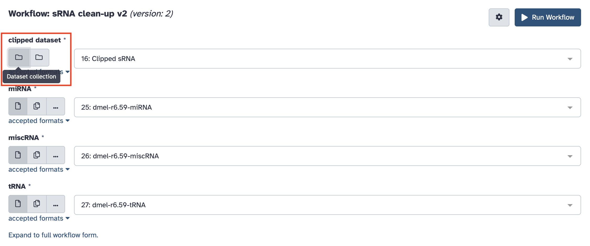

# 1. Traitement des données des petits ARN

!!! attention "Objectif"

	Le but de cette séance de Travaux Pratiques est d’effectuer le traitement des données du séquençage des petits ARN.
	
	À la fin de la séance vous devez pouvoir comparer les profils d’expression des petits ARN de lignées sauvages (WT) et mutantes pour le gène *Kdm3* (GLKD), et avoir caractérisé les piRNA.

!!! hint ""

	Les questions posées tout au long de cette page sont là pour vous guider dans votre analyse, pour vous aider à comprendre ce que vous faites et ainsi mieux appréhender vos résultats. Elles ne sont pas la base de l’évaluation de votre travail aujourd'hui.

Vous allez partir de l'histoire que vous avez créé hier où se trouve les données de séquençage des petits ARN WT et GLKD.

Vous pouvez retrouver les noms des deux échantillons sur lesquels vous aller travailler dans le [tableau partagé accessible en ligne](https://docs.google.com/spreadsheets/d/1ZGyRM1YU9N70Mh-RY5eBubg1dgWqcuvPiPh3lcr1ZeE/edit?gid=243437883).

Les librairies ont été générées à l'aide des [kits de préparation de petits ARN TruSeq d'Illumina](https://support.illumina.com/sequencing/sequencing_kits/truseq-small-rna-kit.html).

--------------------------------------------------------------------------------
## Contrôle qualité des lectures

!!! note "FastQC"

	Pour afficher plusieurs graphiques permettant d’évaluer de façon automatique la qualité des lectures obtenues, nous allons utiliser le logiciel **FastQC**. Il est disponible sur les principaux systèmes d’exploitation actuels (Windows, MacOS et Linux) et peut-être utilisé avec une interface graphique ou bien en ligne de commande. Vous pouvez télécharger l'outil et consulter son mode d’emploi [sur son site internet](https://www.bioinformatics.babraham.ac.uk/projects/fastqc/)

Dans Galaxy vous allez utiliser l’outil ***FastQC Read Quality reports***. Pensez à cliquer sur l'icône en forme de dossier pour accéder à votre collection.

Cliquez sur "Run tool" sans modifier les paramètres.

Si aucune image ne s'affiche, rendez-vous dans les [annexes](./annexes.md#resoudre-les-problemes-daffichage-html-dans-galaxy) pour résoudre ce problème.

En vous aidant de la notice d’utilisation du logiciel, regardez les résultats du contrôle de qualité effectué par FastQC sur votre fichier fastq.

Reportez le "nombre lectures totales" et le "%GC" dans le [tableau partagé](https://docs.google.com/spreadsheets/d/1ZGyRM1YU9N70Mh-RY5eBubg1dgWqcuvPiPh3lcr1ZeE/edit?gid=243437883).

!!! hint "Questions"

	- Les lectures sont-elles de bonne qualité pour poursuivre l’analyse ?
	- Pouvez-vous observer des biais particuliers à prendre en compte pour la suite ?

Vous avez la possibilité de renommer les collections en cliquant sur l'une d'entre elle et dans le nouvelle colonne qui s'ouvre à droite sur le crayon.

!!! note ""

	Vous pouvez supprimer, en cliquant sur l'icône en forme de poubelle (choisissez "Collections and elements"), les données brutes "FastQC on collection : RawData" car elle ne fait que reprendre les données de la page web sous une forme texte et nous n'allons pas en avoir besoin durant le TP. 

--------------------------------------------------------------------------------
## Suppression des séquences des adaptateurs

Les séquences obtenues sont plus longues que celles des petits ARN que l’on veut étudier. Elles contiennent donc les séquences des adaptateurs situées en 3’. Vous allez réaliser une étape de **clipping** qui consiste à supprimer les adaptateurs présents dans les séquences.

Vous allez également profiter de cette étape pour ne conserver que les séquences de tailles comprises entre 19 et 30, celles correspondants aux différentes populations de petits ARN que nous voulons étudier.

Vous allez pour cela utiliser l’outil ***Clip adapter***. Les réglages à modifier sont entourés en rouge sur la copie d'écran ci-dessous.

Sur les fichiers fastq obtenus en sortie de cette étape de clipping, relancez une analyse de la qualité des séquences avec l’outil ***FastQC***.

Reportez le "nombre lectures 19-30nt" et le "%GC" dans le [tableau partagé](https://docs.google.com/spreadsheets/d/1ZGyRM1YU9N70Mh-RY5eBubg1dgWqcuvPiPh3lcr1ZeE/edit?gid=243437883).

!!! hint "Questions"

	- L’étape de clipping a-t-elle bien réalisé ce que vous souhaitiez ?
	- Que pensez-vous de la distribution de taille des séquences ?

### Analyse des séquences surreprésentées

Si vous avez envie de savoir d'où proviennent les séquences marquées comme "Overrepresented sequences" après cette étape. Vous pouvez effectuer un Blast contre le génome de la drosophile pour le savoir.

Copiez la séquence la plus surreprésentée.

Puis collez là dans l'outil [Blast de FlyBase](https://flybase.org/blast/).

Si l'annotation de la séquence cible n'est pas explicite, vous pouvez cliquer sur JBrowse pour le voir où se trouve le HSP (High-scoring Segment Pair) sur le génome.

!!! hint "Question"

	- À votre avis à quoi correspond la séquence la plus surreprésentée que vous avez obtenue ?

--------------------------------------------------------------------------------
## Filtrage des contaminants

### Sélection des éléments biologiques à filtrer

L’objectif de cette étape est de retirer de nos petits ARN certains éléments génomiques sur lesquels on ne veut pas travailler. Il s'agit des éléments suivants :

- miRNA : micro ARN
- miscRNA : small nuclear RNA (snRNA), small nucleolar RNA (snoRNA), et ARN ribosomique (rRNA)
- tRNA : ARN de transferts

Pour ce TP vous allez utiliser la version 6.59 du génome de *Drosophila melanogaster* dont les fichiers de séquence au format fasta sont accessibles sur le [site FTP de Flybase](https://s3ftp.flybase.org/genomes/Drosophila_melanogaster/dmel_r6.59_FB2024_04/fasta/index.html)

### Choix des paramètres d'alignement

Pour effectuer ce filtrage, vous allez réaliser une série d’alignements avec le logiciel **bowtie** contre les différentes les banques fasta de ces éléments génomiques en ne gardant à chaque étape que les séquences qui ne se sont pas alignées.

L’objectif est d’obtenir rapidement les d’alignements pour effectuer cette série de filtrages. En vous aidant de la [documentation du logiciel bowtie](http://bowtie-bio.sourceforge.net/manual.shtml), répondez aux questions ci-dessous.

!!! hint "Questions"

	- Quelle est l'option du paramètre "alignment mode" qui va permettre d’accélérer la vitesse d'alignement ?
	- Quel nombre de mismatch choisir pour filtrer au maximum les séquences contaminantes ?

Nous allons utiliser l’outil ***sR_bowtie*** de Galaxy sur les données clippées en alignant les lectures sur un fichier d’éléments du génome de la drosophile obtenu précédemment.

!!! hint "Question"

	- Quel paramètrage d'alignement allez vous choisir ?

### Récupération des banques de contaminants à filtrer

Reportez vous aux [annexes](./annexes.md#copier-des-fichiers-entre-histoires) pour savoir comment copier les données depuis l'histoire "References" dans celle en cours pour récupérer les séquences fasta suivantes :

- miRNA : dmel-r6.59-miRNA
- miscRNA : dmel-r6.59-miscRNA
- tRNA : dmel-r6.59-tRNA

### Utilisation d'un workflow

Ces filtrages sont répétitifs. Vous allez utiliser un workflow pour lancer automatiquement les 3 étapes de filtration contre les miRNA, miscRNA et tRNA. 

Le workflow "sRNA clean-up v2" que vous allez utiliser est disponible [en cliquant ici](https://psilo.sorbonne-universite.fr/index.php/s/Kdm3_smallRNAseqData/download?path=%2F&files=Galaxy-Workflow-sRNA_clean-up_v2.ga)

Aidez-vous du tutoriel [Running a galaxy workflow](https://artbio.github.io/startbio/AnalyseGenomes_2025/Run_workflow/) que vous avez vu hier et lancez le workflow sur les données clippées.

!!! danger "Attention"

	Les deux icônes de choix des données sont identiques. Il faut choisir "Dataset collection" et pas "Multiple collection" ! L'icône de gauche.

Sur les fichiers fastq obtenus en sortie de ce filtrage, relancez une analyse de la qualité des séquences avec l’outil ***FastQC***.

N'oubliez pas de renommer chaque étape dans l'histoire Galaxy pour vous y retrouver plus facilement.

Reportez le "nombre de lectures nettoyées" et leur "%GC" dans le [tableau partagé](https://docs.google.com/spreadsheets/d/1ZGyRM1YU9N70Mh-RY5eBubg1dgWqcuvPiPh3lcr1ZeE/edit?gid=243437883).

Reportez également le nombre de lectures alignées à chaque étape du filtrage. Attention ! ces informations ne se trouvent pas dans l'histoire. Pour les obtenir il faut cliquer sur l'icône "Workflow invocations" dans la barre de gauche.

Les différents lancement du workflow qui ont été effectués apparaissent dans une liste. Affichez les détails d'un lancement en cliquant sur l'élément de la liste qui vous intéresse. Cachez le graphique du workflow pour mieux visualiser ses étapes en cliquant sur le bouton "Hide graph". Sélectionnez ensuite l'étape qui vous intéresse puis sur "Output Dataset Collections", sur "Bowtie output" et enfin sur l'échantillon que vous voulez analyser. En déployant les résultats vous pouvez accéder pour vos échantillons aux sorties de l'outil d'alignement Bowtie.

--------------------------------------------------------------------------------
## Alignement des lectures sur la région *PLacZ*

Pour aller plus loin dans l’analyse des loci producteurs de petits ARN, vous allez aligner spécifiquement les séquences que vous avez obtenues sur celle du transgène ***PLacZ***.

Reportez vous aux [annexes](./annexes.md#copier-des-fichiers-entre-histoires) pour savoir comment copier les données entre historiques pour récupérer la séquence fasta de *PLacZ*.

Vous allez utiliser l’outil ***sR_bowtie*** sur les données nettoyées précédentes en alignant les lectures sur la séquence de *PLacZ*. On cherche maintenant à obtenir des alignements à 1 seule position sur la séquence même si ils peuvent s'aligner à plusieurs endroits.

!!! hint "Questions"

	- Quelle option de sRbowtie allez-vous choisir ?
	- À quels paramètres du logiciel bowtie cette option correspond-elle ?

Lancez l’alignement une fois que vous avez déterminé les paramètres optimaux pour votre analyse.

!!! note ""

	La sortie standard et l’erreur standard sont accessibles dans Galaxy. Pour cela vous devez cliquer dans votre jeu de données sur l’icône d’information (i). La page qui s’affiche vous donne accès aux paramètres de lancement de l’outil utilisé et aux différentes sorties produites.

--------------------------------------------------------------------------------
## Comparaison des distributions des petits ARN entre conditions

Vous allez maintenant comparer la distribution des petits ARN sur PLacZ entre les conditions WT et GLKD.

Vous allez réaliser des graphiques et quantifier la répartition des 2 types de petits ARN (siRNA et piRNA) alignés sur la séquence de PLacZ à partir des lectures de vos différents échantillons. 

La première étape consiste à extraire les deux alignements que vous avez obtenus à l'étape précédente de la collection où ils se trouvent. Reportez vous aux [annexes](./annexes.md#extraire-des-elements-dune-collection) pour savoir comment procéder.

Puis vous utiliserez l’outil ***small_rna_maps*** sur chacun de vos fichiers d’alignement extrait en prenant soin d’indiquer pour chacun le facteur de normalisation permettant de corriger les lectures calculés dans le [tableau partagé](https://docs.google.com/spreadsheets/d/1ZGyRM1YU9N70Mh-RY5eBubg1dgWqcuvPiPh3lcr1ZeE/edit?gid=243437883). 

Les facteurs de normalisation sont entrés dans l'ordre des fichiers sélectionnés.

Relancez l’outil ***small_rna_maps*** en modifiant les options du graphique avec les paramètres ci-dessous.

!!! hint "Question"

	- Quelle interprétation faites-vous des histogrammes que vous obtenez ?

--------------------------------------------------------------------------------
## Obtention des piRNA

### Sélection de la taille des petits ARN

Les séquences de piRNA sont comprises entre 23 et 29 nucéotides. Vous allez réutiliser l’outil ***Clip adapter***. 

Sur les fichiers fastq obtenus en sortie de cette étape, relancez une analyse de la qualité des séquences avec l’outil ***FastQC*** afin de vous assurer que tout c'est passé comme vous l'attendiez.

Reportez le "nombre de lectures 23-29nt" et le "%GC" dans le [tableau partagé](https://docs.google.com/spreadsheets/d/1ZGyRM1YU9N70Mh-RY5eBubg1dgWqcuvPiPh3lcr1ZeE/edit?gid=243437883).

### Conserver les piRNA "uniques"

Le but est maintenant de conserver les piRNA qui s'alignent uniquement à un seul endroit. Pour cela on va sélectionner les piRNA qui s'alignent de façon unique sur le génome sans aucun mismatch.

On utilise l’outil ***sR_bowtie*** sur les piRNA de 23-29 nt. On cherche à obtenir des alignements uniques sans ambiguïtés et sans mismatch.

!!! hint "Questions"

	- Quelle option de sRbowtie allez-vous choisir ?
	- À quels paramètres du logiciel bowtie cette option correspond-elle ?

Lancez l’alignement une fois que vous avez déterminé les paramètres optimaux pour votre analyse.

!!! danger "Attention"

	Vous voulez récupérer les fichiers Fastq de ces piRNA uniques. Il ne faut pas oublier de sélectionner "Additional fasta output : aligned" dans les options de l'outil.

Sur les fichiers fastq des piRNA uniques relancez une analyse de la qualité des séquences avec l’outil ***FastQC***.

Reportez le "nombre de lectures piRNA uniques" dans le [tableau partagé](https://docs.google.com/spreadsheets/d/1ZGyRM1YU9N70Mh-RY5eBubg1dgWqcuvPiPh3lcr1ZeE/edit?gid=243437883).

--------------------------------------------------------------------------------
## Analyse des piRNA uniques

En principe la première position d'un piRNA commence majoritairement par une base Uracile. Vous allez vérifier si vos séquences ont cette caractéristique.

### Sélection des 10 premières bases des séquences

Vous allez utiliser l'outil **Trimmomatic** sur les piRNA uniques pour couper les séquences à 10 nucléotides.

### Conversion des fichiers Fastq en fasta

Pour cette étape vous utiliserez l'outil **sequence_format_converter**. En effet, l'outil qui représente graphiquement la distribution des bases n'accepte pas les fichiers Fastq en entrée. Seulement les fichiers Fasta.

### Transformation des bases T en U

Vous avez séquencé de l'ADN mais nous voulons comparer les séquences originales des piRNA. Pour cela vous devez convertir les bases T en U à l'aide de l'outil **Regex Find And Replace**.

### Représenter graphiquement la distribution des bases

Vous allez réaliser un "Sequence logo" permettant de représenter la probabilité de trouver chaque base le long des 10 nucléotides de la séquence. Pour en savoir plus vous pouvez consulter le site [WebLogo](https://weblogo.threeplusone.com/).

Utiliser l'outil **Sequence Logo** pour obtenir ce graphique.

### Compter le nombre de séquences commençant par un U

Pour finir vous allez compter le nombre de séquences commençant par U. Pour cela vous utiliserez l'outil **Search in textfiles**.

Reportez le "nombre séquences commençant par un U" dans le [tableau partagé](https://docs.google.com/spreadsheets/d/1ZGyRM1YU9N70Mh-RY5eBubg1dgWqcuvPiPh3lcr1ZeE/edit?gid=243437883).

!!! hint "Question"

	Les petis ARN que vous avez sélectionnés sont-ils bien des piRNA ?

